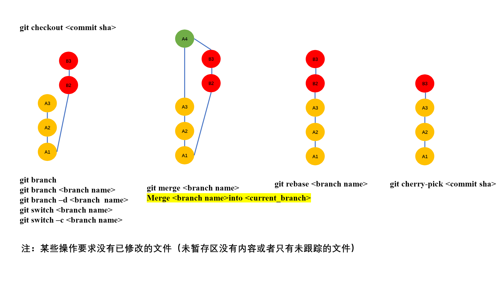
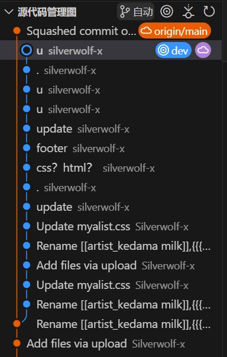

虽然可以在vscode可以直接按按钮，但一些基本的命令行和原理还是要掌握的

## git tag

> vscode: 标记

git tag给某一次commit做一次静态标注。可以commit注释。常用于git release发布版本（放置大文件到git release）

**默认使用当前branch的最新commit**

```
git tag -a v1.0.0 -m "Release version 1.0.0" 
git push origin --tags # 推送本地所有tag
```
删除标签

```
git tag -d {标签名}
git push origin :refs/tags/{标签名}
```

vscode按按钮同步tag

- [VSCode配置git push --tags_vscode push tag-CSDN博客](https://blog.csdn.net/u010214511/article/details/127030248)

### 在本地tag和远程tag取交集

**在本地tag和远程tag取交集，删除本地和远程的其他tag。然后同步两边的仓库。在win和linux都实现**

```bash
#!/bin/bash

# 获取本地和远程标签
local_tags=$(git tag)
remote_tags=$(git ls-remote --tags origin | sed 's/.*\///')

# 计算交集
intersection=$(echo "$local_tags" "$remote_tags" | tr ' ' '\n' | sort | uniq -d)

# 删除本地没有交集的标签
for tag in $local_tags; do
  if [! echo "$intersection" | grep -q "$tag"]; then
    echo "Deleting local tag: $tag"
    git tag -d "$tag"
  fi
done

# 删除远程没有交集的标签
for tag in $remote_tags; do
  if [! echo "$intersection" | grep -q "$tag"]; then
    echo "Deleting remote tag: $tag"
    git push --delete origin "$tag"
  fi
done

# 推送交集标签到远程
for tag in $intersection; do
  echo "Pushing tag to remote: $tag"
  git push origin "$tag"
done

# 拉取远程标签到本地
git fetch --tags
echo "Sync complete."

```

### tag注释信息

tag储存了信息：显示tag为^{}

> [!note]
>
> `refs/tags/v0.1.6` ref 指向 tag 对象，而该对象 `bb9446` 又指向 `771a930` （非标签对象），我猜该对象在您创建标签时存储了提交信息。
>因此，当你执行 `refs/tags/v0.1.6^{}` 时，git 将取消引用标签并将其解析为 `771a93`  非标签对象。

## git lfs使用和删除

[github大文件上传：使用LFS （以及如何将lfs从仓库中移除！）_github lfs-CSDN博客](https://blog.csdn.net/weixin_39278265/article/details/121103819)

删除：

```
git lfs uninstall
git filter-branch --force --index-filter "git rm --cached --ignore-unmatch" results_bears/results_bears_processed_machine_1.tar.lrz results_bears/results_bears_processed_machine_2.tar.lrz" --prune-empty --tag-name-filter cat -- --all
git push origin master -f 


git lfs uninstall
git filter-branch --force --index-filter "git rm --cached --ignore-unmatch model/" --prune-empty --tag-name-filter cat -- --all

然后重新git push origin master -f 就行

```

## .gitignore失效

[.gitignore文件不起作用的解决方法 - 知乎 (zhihu.com)](https://zhuanlan.zhihu.com/p/334908553)

```
git rm -r --cached .
git add .
git commit -m 'update .gitignore'
git push
```

- **仓库删除model文件夹，改为release上传，避免git lfs爆免费额度**
- **更新`README.md`表述**

## 配置username useremail

```console
git config user.name "silverwolf-x@Arch"
git config user.email silverwolf-x@qq.com
```

## 合并



### merge合并dev分支并删除

要将 `dev` 分支合并到 `master` 并删除 `dev` 分支，同时将这些操作应用于远程仓库，以下是详细的步骤：

```bash
git checkout main
git merge dev
git push origin main
git branch -d dev
git push origin --delete dev
```

如果只要一个commit，如下操作

```bash
git checkout main
git merge --squash dev
git commit -m "Merge dev into main"
git push origin main -f
```



### 分支改名

```bash
git branch -m old-branch new-branch
git push origin --delete old-branch
git push origin new-branch
git push --set-upstream origin new-branch
```

### 回退合并

```
git reset --merge 1c206c6280d053fc63c31f5e6966bf5d043420c3
git push -f
```

==要用变基得遵守一条准则：**如果提交存在于你的仓库之外，而别人可能基于这些提交进行开发，那么不要执行变基。**==

## commit规范

https://www.conventionalcommits.org/zh-hant/v1.0.0/

提交應包含以下結構性元素，用以向使用這套函式庫的使用者溝通當時的意圖：

1. **fix:** 為 `fix` *類型* 的提交，表示對程式修正了一個臭蟲（bug）（對應到語意化版本中的 [`修訂號 PATCH`](https://semver.org/lang/zh-TW/#摘要)）。
2. **feat:** 為 `feat` *類型* 的提交，表示對程式增加了一個功能（對應到語意化版本中的 [`次版本 MINOR`](https://semver.org/lang/zh-TW/#摘要)）。
3. **BREAKING CHANGE:** 重大變更，如果提交的頁腳以 `BREAKING CHANGE:` 開頭，或是在類型、作用範圍後有 `!`，代表包含了重大 API 變更（對應到語意化版本中的 [`主版本 MAJOR`](https://semver.org/lang/zh-TW/#摘要)）。 重大變更可以是任何 *類型* 提交的一部分。
4. 其他: 除 `fix:` 與 `feat:` 以外，其他的提交 *類型* 也是被允許的，例如 [@commitlint/config-conventional](https://github.com/conventional-changelog/commitlint/tree/master/@commitlint/config-conventional) (基於 [Angular 慣例](https://github.com/angular/angular/blob/22b96b9/CONTRIBUTING.md#-commit-message-guidelines)) 中推薦的 `chore:`、`docs:`、`style:`、`refactor:`、`perf:`、`test:` 以及更多。

我們也推薦對那些沒有增加新功能或是修正臭蟲而是改善目前實作的提交使用 `improvement`。 請注意，這些類型在慣例式提交規範中並不是強制性的，且在語意化版本中也沒有隱含的作用 (除非它們包含 BREAKING CHANGE)。

1. 除了 `fix:` 與 `feat:` 之外也允許其他的 *類型* ，如（基於 [Angular 慣例](https://github.com/angular/angular/blob/22b96b9/CONTRIBUTING.md#-commit-message-guidelines)的）[@commitlint/config-conventional](https://github.com/conventional-changelog/commitlint/tree/master/@commitlint/config-conventional) 推薦使用 `build:` 與 `chore:`、 `ci:`、`docs:`、`style:`、`refactor:`、`perf:`、`test:`、等其他。
2. 也可以使用 `BREAKING CHANGE: <描述>` 之外的 *頁腳* ，並遵守類似 [git trailer format](https://git-scm.com/docs/git-interpret-trailers) 的慣例。

追加類型並不被慣例式提交所束縛，並且不對語義化版本有任何隱藏的影響。（但若包含 BREAKING CHANGE 則不在此限。） 提交的類型可以在括號內給予作用範圍，以提供額外的脈絡資訊。例如：`feat(parser): add ability to parse arrays`。

## jsDelivr使用

在https://www.jsdelivr.com/tools/purge刷新，或者改https://cdn.jsdelivr.net/gh/Silverwolf-x/Better_Alist@main/myalist.css把cdn改为purge

## unfork

https://docs.github.com/zh/pull-requests/collaborating-with-pull-requests/working-with-forks/detaching-a-fork

